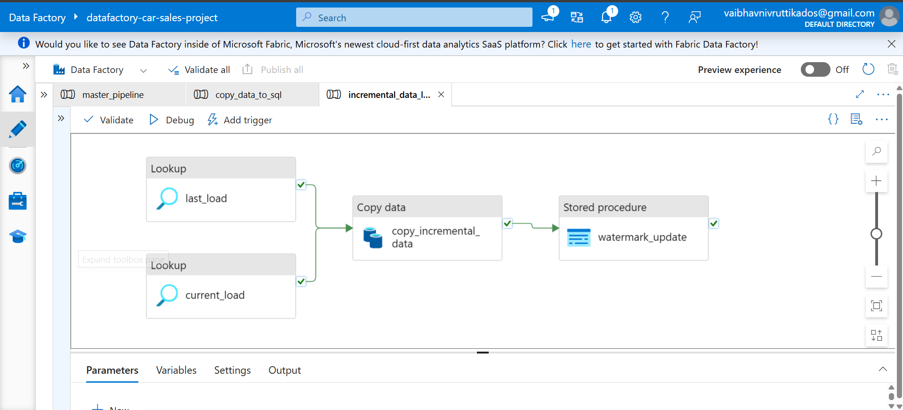
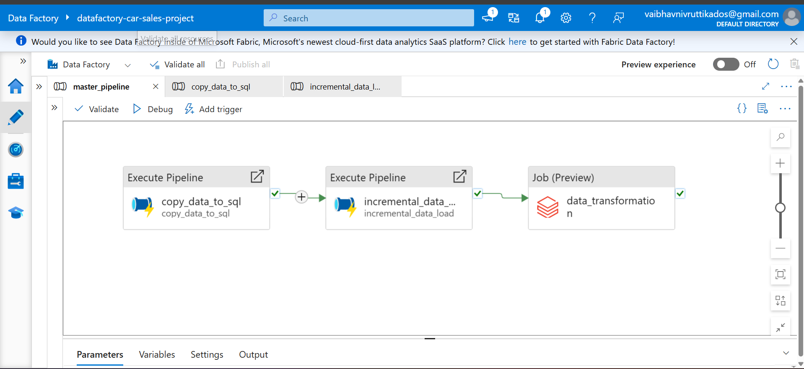
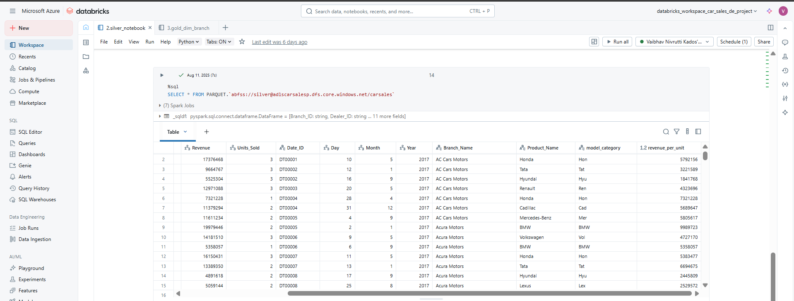
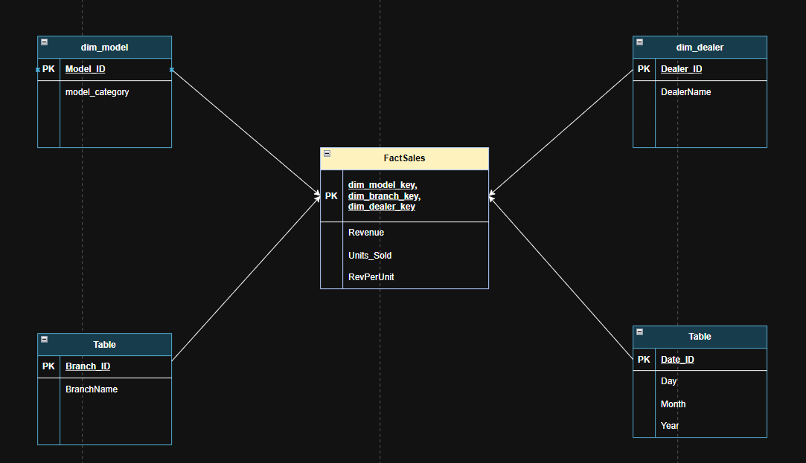
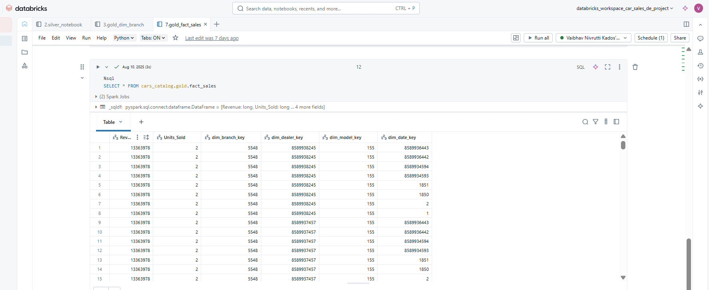
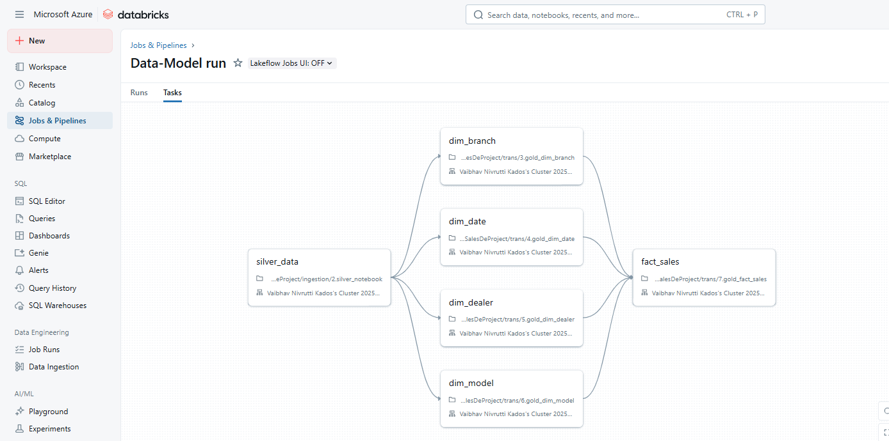

# 🚗 Azure End-to-End Data Engineering Project – Car Sales Analytics  

## 📖 Project Description  
This project demonstrates the design and implementation of a **modern end-to-end data engineering pipeline** on Microsoft Azure for a **Car Sales Analytics use case**.  

The objective is to build a solution that:  
- Ingests **car sales data** from source systems incrementally  
- Stores it in a **Data Lakehouse architecture (Bronze → Silver → Gold)**  
- Performs **data transformations, enrichment, and business modeling**  
- Creates a **star schema** with fact and dimension tables for reporting  
- Ensures **scalability, automation, and data quality**  

  

---

## 🏗️ Architecture  
The solution follows the **Medallion Architecture** pattern:  

1. **Bronze Layer** – Raw ingested data from source systems  
2. **Silver Layer** – Cleaned and enriched data (standardized schema, calculated attributes)  
3. **Gold Layer** – Business-ready **star schema** for analytics  

**Azure Services Used:**  
- **Azure Data Factory (ADF):** Orchestration & incremental ingestion  
- **Azure SQL Database:** Source schema & watermarking for incremental loads  
- **Azure Data Lake Gen2 (ADLS):** Storage for Bronze/Silver/Gold layers  
- **Azure Databricks:** Data transformation & business modeling using Delta Lake  
- **Unity Catalog:** Data governance & schema management  
- **Power BI:** Dashboarding layer (optional for visualization)  

  

---

## 🔄 Data Pipeline Workflow  

### 1. Data Ingestion (ADF → ADLS Bronze)  
- Source **car sales data** is stored in **Azure SQL Database**.  
- **ADF pipelines** copy this data into **ADLS Bronze** in **Parquet format**.  
- Incremental ingestion is enabled using a **watermarking mechanism** (`last_load_date`).  

  
  

---

### 2. Data Transformation (Databricks → ADLS Silver)  
- **Databricks notebooks (PySpark)** process Bronze data.  
- Transformations applied:  
  - Derived **Model Category** from Model ID  
  - Calculated **Revenue per Unit**  
  - Standardized schema & handled null values  
- Output written to **Silver container** in Delta format.  

  

---

### 3. Business Modeling (Databricks → ADLS Gold)  
- Designed a **Star Schema** for business reporting:  
  - **Dimension Tables:** `dim_model`, `dim_dealer`, `dim_branch`, `dim_date`  
  - **Fact Table:** `fact_sales`  
- Implemented **SCD Type 1** for dimensions using Delta Lake `merge`.  
- Fact table created by joining Silver sales data with dimensions.  

This schema supports analytics such as:  
- Dealer and branch performance  
- Model-wise sales trends  
- Revenue growth analysis  

  
  

---

### 4. Automation (Databricks Workflows)  
- Orchestrated transformations using **Databricks Workflows**:  
  - Silver processing → Dimensions update → Fact table load  
- Supports both **initial load** and **incremental updates**.  

  

---

## 📊 Results  
- **Bronze:** Raw ingested data (Parquet format)  
- **Silver:** Cleaned & enriched data (Delta format)  
- **Gold:** Star schema with Fact & Dimension tables (Delta format)  

  

---

## ▶️ Running the Project  
1. Deploy Azure resources (ADLS, ADF, SQL DB, Databricks)  
2. Import ADF pipelines & configure Linked Services  
3. Load sample car sales data into Azure SQL Database  
4. Import Databricks notebooks into workspace  
5. Configure Unity Catalog & external locations  
6. Run ADF pipeline (initial + incremental load)  
7. Execute Databricks Workflow to process Bronze → Silver → Gold  
8. Validate Gold tables / Connect Power BI for reporting  

---

## 📚 Key Learnings  
- Implemented **incremental ingestion** with ADF watermarking  
- Built a **Lakehouse architecture (Bronze → Silver → Gold)**  
- Handled **Slowly Changing Dimensions (SCD Type 1)** with Delta Lake  
- Designed a **Star Schema** for analytics  
- Automated workflows with **Databricks Orchestration**  

---

## 🤝 Connect  
- 🔗 LinkedIn: *[[Vaibhav Kados]](https://www.linkedin.com/in/vaibhav-kados-45689020a/)*  
